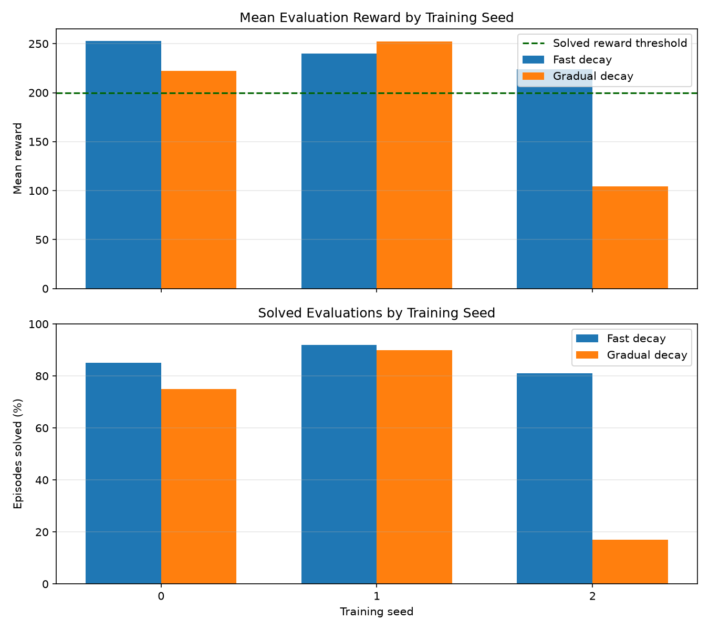

# The Effect of Exploration Decay on DQN Performance in LunarLander-v3

## 1. Project overview

This project studies how the rate of epsilon decay affects the performance
and reliability of a Deep Q-Network agent in Gymnasium's LunarLander-v3
environment.

The research question is:

> How does epsilon-decay speed affect DQN performance and consistency in
> LunarLander-v3?

Two agents use the same neural network, optimizer, replay memory, training
budget, and evaluation procedure. The primary changed variable is the
epsilon-decay factor.

## 2. Environment

LunarLander-v3 is a physics-based Gymnasium environment. The observation is
an eight-dimensional continuous vector containing position, velocity, angle,
angular velocity, and leg-contact information.

The agent has four discrete actions:

1. Do nothing
2. Fire the left orientation engine
3. Fire the main engine
4. Fire the right orientation engine

Because the observation space is continuous, a traditional Q-table would be impractical. Therefore, this project uses a neural network to approximate Q-values.

## 3. Model and Approach

For this project, I used a **Deep Q-Network (DQN)** to train an agent in the `LunarLander-v3` environment.

I chose DQN because LunarLander has a continuous observation space. The lander’s position, speed, angle, and other values can take many possible forms, so creating a traditional Q-table for every possible state would not be practical. Instead, DQN uses a neural network to estimate the value of each available action.

### 3.1 Neural Network

The LunarLander environment gives the agent eight observation values:

1. Horizontal position
2. Vertical position
3. Horizontal velocity
4. Vertical velocity
5. Lander angle
6. Angular velocity
7. Whether the left leg is touching the ground
8. Whether the right leg is touching the ground

These eight values are used as the input to the neural network.

The network structure is:

```text
8 input values
→ 128 hidden neurons
→ 128 hidden neurons
→ 4 output values
```

The four output values represent the estimated Q-values of the four possible actions:

1. Do nothing
2. Fire the left orientation engine
3. Fire the main engine
4. Fire the right orientation engine

The hidden layers use the ReLU activation function. ReLU helps the network learn more complicated relationships between the lander’s current state and the possible actions.

During evaluation, the agent selects the action with the highest predicted Q-value. During training, it sometimes takes a random action so that it can explore the environment.

### 3.2 Epsilon-Greedy Exploration

I used an **epsilon-greedy strategy** to balance exploration and exploitation.

Exploration means trying random actions to discover new strategies. Exploitation means choosing the action that the neural network currently believes is best.

At the beginning of training, epsilon starts at `1.0`. This means the agent takes many random actions and explores different outcomes.

As training continues, epsilon gradually decreases toward `0.05`. The agent then relies more often on the actions recommended by its neural network.

The main goal of this project was to compare two epsilon-decay schedules:

| Schedule | Starting epsilon | Minimum epsilon | Decay factor |
|---|---:|---:|---:|
| Fast decay | 1.00 | 0.05 | 0.98 |
| Gradual decay | 1.00 | 0.05 | 0.995 |

The fast-decay agent reduces random exploration more quickly and begins relying on its learned policy earlier.

The gradual-decay agent keeps exploring for a longer period before relying mostly on the neural network.

All other major training settings were kept the same so that the comparison would be fair.

### 3.3 Replay Memory

DQN uses a replay memory to store the agent’s previous experiences.

Each experience contains:

- The current state
- The selected action
- The reward
- The next state
- Whether the episode ended

The replay memory can store up to 50,000 experiences.

During training, the agent randomly samples batches of 128 experiences from the replay memory. These samples are then used to update the neural network.

Random sampling is useful because consecutive steps in an episode are often very similar. If the network trained only on experiences in their original order, it could focus too much on recent events.

Replay memory mixes older and newer experiences together, which helps make training more stable.

The agent begins updating the network after at least 1,000 experiences have been collected.

### 3.4 Policy Network and Target Network

The project uses two neural networks:

- The **policy network**
- The **target network**

The policy network selects actions and is updated during training.

The target network is used to calculate more stable target Q-values.

If the same network were used to make predictions and calculate its own training targets, those targets could change too quickly. This could make the learning process unstable.

The target network changes more slowly than the policy network. This gives the agent a more consistent value to learn from.

I used a soft-update rate of `0.005`. After each training update, a small portion of the policy network’s weights is copied into the target network.

### 3.5 Network Training

The neural network was trained using the AdamW optimizer with a learning rate of `0.0003`.

I used Smooth L1 loss to measure the difference between the predicted Q-values and the target Q-values. Smooth L1 loss is less sensitive to very large errors than regular squared-error loss, which can help make training more stable.

The discount factor was set to `0.99`.

A discount factor close to 1 means that the agent gives strong importance to future rewards instead of focusing only on the immediate reward.

This is important in LunarLander because an action may not give an immediate reward but may help the lander reach a safer position later.

The main training settings were:

| Setting | Value |
|---|---:|
| Training episodes per model | 800 |
| Replay-memory capacity | 50,000 |
| Minimum replay size | 1,000 |
| Batch size | 128 |
| Discount factor | 0.99 |
| Learning rate | 0.0003 |
| Target-network update rate | 0.005 |
| Training seeds | 0, 1, and 2 |

---

## 4. Experimental Design

The purpose of the experiment was to compare fast and gradual epsilon decay while keeping the rest of the DQN setup the same.

The main independent variable was the epsilon-decay factor:

| Schedule | Decay factor |
|---|---:|
| Fast decay | 0.98 |
| Gradual decay | 0.995 |

The following settings remained the same for both schedules:

- Neural network structure
- Optimizer
- Learning rate
- Replay-memory size
- Batch size
- Discount factor
- Target-network update rate
- Number of training episodes
- Training seeds
- Evaluation seeds
- Evaluation method

Keeping these settings the same made it easier to connect any major performance difference to the exploration schedule.

### 4.1 Training Setup

Each epsilon schedule was trained three times using different random seeds:

- Seed 0
- Seed 1
- Seed 2

This created six trained models:

- Three fast-decay models
- Three gradual-decay models

Each model was trained for 800 episodes.

The complete training experiment included:

```text
2 epsilon schedules × 3 training seeds × 800 episodes
= 4,800 training episodes
```

Using multiple training seeds was important because reinforcement-learning results can change between runs.

The environment’s starting conditions, random actions, neural-network weights, and replay-memory samples can all be different depending on the seed.

Running each schedule three times helped me check whether the results were consistent or depended too heavily on one unusually successful run.

### 4.2 Evaluation Setup

After training, each of the six models was evaluated for 100 episodes.

The evaluation seeds ranged from `1000` to `1099`. These seeds were not used during training.

During evaluation:

- Epsilon was set to zero
- The agent always selected the action with the highest predicted Q-value
- No random exploration was used
- The neural network was not updated
- No new training took place

The evaluation measured what each model had already learned.

The complete evaluation included:

```text
6 trained models × 100 evaluation episodes
= 600 evaluation episodes
```

Every model was tested using the same 100 evaluation seeds. This made the comparison more controlled because each agent faced the same starting conditions.

### 4.3 Evaluation Measurements

I compared the models using the following measurements:

- Mean episode reward
- Median episode reward
- Reward standard deviation
- Minimum and maximum reward
- Number of solved episodes
- Solved percentage
- Consistency across training seeds
- Number of episodes reaching the time limit

An episode was treated as solved when the total reward was at least 200.

Looking at several measurements was important because average reward alone does not tell the whole story.

For example, a model could have a high average reward but still perform poorly on many episodes. A reliable model should have both strong average performance and reasonably consistent results.

---

## 5. Troubleshooting and Iterative Development

I developed the project in several stages instead of immediately running the full experiment.

This made it easier to find problems early and avoid wasting time on long training runs.

### 5.1 Environment Check

The first step was to confirm that Gymnasium and the `LunarLander-v3` environment were installed correctly.

I ran a simple agent that selected random actions using:

```python
action = environment.action_space.sample()
```

This check confirmed that:

- The environment could be created
- The environment could be reset
- Actions could be passed into the environment
- Rewards and observations were returned correctly
- Episodes ended correctly
- The environment could be closed without errors

This simple test followed the same basic environment loop shown in the Gymnasium documentation.

### 5.2 Random Baseline

After confirming that the environment worked, I ran a random-action agent for 100 episodes.

The purpose of the random baseline was not to solve LunarLander. It gave me a basic result that the trained DQN models could be compared against.

The random agent produced a mean reward of `-191.00` and did not solve any of the 100 episodes.

This showed that random actions were not enough to perform well in the environment.

### 5.3 Testing Individual DQN Components

Before running the complete training process, I tested the main DQN components separately.

The tests checked areas such as:

- Neural-network output shape
- Replay-memory storage
- Replay-memory sampling
- Epsilon calculation
- Target-network updates
- Whether one optimization step changed the policy network
- Whether checkpoints could be saved and loaded
- Whether evaluation avoided changing the trained model

Testing the smaller parts first made it easier to identify problems before combining everything into one training loop.

### 5.4 Short Development Run

I first ran a short 25-episode development experiment.

This run was not meant to produce a strong final agent. Its purpose was to check that the complete pipeline worked.

The development run confirmed that:

- Experiences were added to replay memory
- Optimization began after enough experiences were collected
- Rewards were recorded
- Epsilon decreased correctly
- Model checkpoints were saved
- Evaluation files could be created
- Plots could be generated

The development run had a mean training reward of `-118.88`.

When the early model was evaluated on 25 unseen seeds, it produced a mean reward of `-92.34`. It did not solve any episodes.

This result was expected because 25 training episodes were not enough for the DQN agent to learn the full landing task.

### 5.5 Resuming Interrupted Experiments

The complete experiment required six models and thousands of episodes, so it took much longer than the development tests.

The experiment runner was designed to check whether each model had already been completed. If training was interrupted, the runner could continue from the unfinished models instead of repeating all completed runs.

This became useful when the first full experiment did not finish in one execution window.

The program recognized the four completed models and continued with the remaining two. This saved time and prevented completed results from being overwritten.

### 5.6 Gradual-Decay Seed 2

One result that stood out was the gradual-decay model trained with seed 2.

Its training performance improved during the later part of training, but its performance on unseen evaluation seeds was much weaker.

The model had a mean evaluation reward of `104.08`, and only 17 of the 100 evaluation episodes were solved.

It also reached the 1,000-step time limit in 54 episodes.

I kept this result instead of removing it because it shows an important part of reinforcement learning: a method may work well for some random seeds but poorly for others.

This result also shows why it is important to evaluate several independently trained models instead of reporting only the best run.

---

## 6. Results

### 6.1 Random-Agent Baseline

The random-action baseline was run for 100 episodes using seeds 0 through 99.

| Measurement | Random baseline |
|---|---:|
| Mean reward | -191.00 |
| Median reward | -167.31 |
| Reward standard deviation | 107.46 |
| Minimum reward | -428.73 |
| Maximum reward | 51.35 |
| Solved episodes | 0/100 |
| Solved percentage | 0.00% |

The random agent did not reach the solved threshold in any episode.

This gave the project a simple baseline for showing that the trained DQN agents learned behavior that was better than random action selection.

### 6.2 Individual Model Results

Each trained model was evaluated for 100 episodes using the same unseen seeds.

| Epsilon schedule | Training seed | Mean reward | Reward SD | Solved episodes |
|---|---:|---:|---:|---:|
| Fast decay | 0 | 252.76 | 52.52 | 85/100 |
| Fast decay | 1 | 239.84 | 25.61 | 92/100 |
| Fast decay | 2 | 223.72 | 87.12 | 81/100 |
| Gradual decay | 0 | 222.42 | 63.84 | 75/100 |
| Gradual decay | 1 | 252.32 | 39.28 | 90/100 |
| Gradual decay | 2 | 104.08 | 85.84 | 17/100 |

The fast-decay models all had mean rewards above 200.

The gradual-decay models produced mixed results. Seeds 0 and 1 performed well, but seed 2 performed much worse.

### 6.3 Combined Schedule Results

The results from the three training seeds were combined for each epsilon schedule.

Each combined schedule result contains 300 evaluation episodes.

| Measurement | Fast decay | Gradual decay |
|---|---:|---:|
| Mean reward | 238.77 | 192.94 |
| Median reward | 255.41 | 236.15 |
| Reward standard deviation | 61.52 | 91.71 |
| Solved episodes | 258/300 | 182/300 |
| Solved percentage | 86.00% | 60.67% |
| Standard deviation between seed means | 14.55 | 78.39 |

The fast-decay schedule had a mean reward that was `45.83` points higher than the gradual-decay schedule.

The fast-decay solved percentage was also `25.33` percentage points higher.

The standard deviation between the three seed-level means was much lower for fast decay. This suggests that the fast-decay results were more consistent across the three training seeds.

### 6.4 Final Comparison Plot



The comparison plot shows that fast decay had stronger overall performance and less variation between training seeds.

Gradual decay was more sensitive to the selected training seed, mainly because the model trained with seed 2 performed poorly during evaluation.

---

## 7. Discussion and Interpretation

### 7.1 Overall Performance

Under the settings used in this project, fast epsilon decay produced stronger overall results than gradual epsilon decay.

The fast-decay models achieved:

- A higher combined mean reward
- A higher solved percentage
- A lower variation between training seeds
- A mean reward above 200 for all three trained models

The gradual-decay schedule performed well for seeds 0 and 1, but its seed 2 model had much weaker results.

This lowered the combined average and showed that gradual decay was less reliable across the three runs.

### 7.2 Exploration and Exploitation

One possible explanation is that the fast-decay agents began using their learned policies earlier.

LunarLander has a clear task: control the lander, reduce speed, stay balanced, and land between the flags.

Once an agent begins discovering useful behavior, too much continued random exploration may interrupt that behavior.

The gradual-decay agents continued taking random actions for a longer period. These random actions may have created more varied experiences, but they may also have made learning less stable under the fixed 800-episode training budget.

Fast decay may have allowed the agents to focus earlier on improving the useful actions they had already discovered.

However, this is an interpretation of the results rather than proof of the exact cause.

### 7.3 Importance of Multiple Seeds

The gradual-decay seed 2 model shows why reporting only one training run can be misleading.

If I had reported only gradual-decay seed 1, gradual decay would have appeared very successful. That model had a mean reward of `252.32` and solved 90% of its evaluation episodes.

However, gradual-decay seed 2 had a mean reward of only `104.08` and solved 17% of the episodes.

Using three seeds gave a more complete picture of the schedule’s reliability.

### 7.4 Training Performance and Evaluation Performance

Another important result was that strong training performance did not always lead to strong unseen-seed evaluation performance.

The gradual-decay seed 2 agent improved during training, but it did not generalize well to many evaluation seeds.

This may mean that the agent learned a policy that worked for some situations but was not reliable across a wider range of starting conditions.

It also shows why the final evaluation used seeds that were not seen during training.

Without unseen-seed evaluation, the project might have overestimated the quality of that model.

### 7.5 Comparison with the Random Baseline

Both DQN schedules performed much better than the random-action baseline.

The random agent had:

- A mean reward of `-191.00`
- No solved episodes

The fast-decay DQN had:

- A mean reward of `238.77`
- A solved percentage of `86.00%`

The gradual-decay DQN had:

- A mean reward of `192.94`
- A solved percentage of `60.67%`

This large difference shows that the DQN agents learned useful control behavior instead of acting randomly.

---

## 8. Limitations

This project has several limitations.

### 8.1 Small Number of Training Seeds

Each epsilon schedule was trained using only three seeds.

Three seeds are better than one, but they are still not enough to make a broad statistical claim about all possible DQN training runs.

More training seeds would provide a more reliable estimate of average performance and variation.

### 8.2 Only Two Exploration Schedules

The experiment compared only two epsilon-decay factors:

- `0.98`
- `0.995`

There may be another decay factor between these values, or outside this range, that performs better.

The project therefore compares two selected schedules rather than finding the best possible epsilon schedule.

### 8.3 One Environment

The experiment used only `LunarLander-v3`.

The result does not show that fast epsilon decay is always better in other reinforcement-learning environments.

A different environment may require longer exploration or may react differently to the same schedules.

### 8.4 Fixed Network and Hyperparameters

The project used one neural-network structure and one set of training settings.

The results may change with:

- A larger or smaller network
- A different learning rate
- A different replay-memory size
- A different batch size
- A different target-update rate
- A longer training period

Because these values were kept fixed, the conclusion applies only to the tested configuration.

### 8.5 Fixed Training Budget

Each model was trained for 800 episodes.

Gradual decay may benefit from a longer training period because it continues exploring for more episodes.

The 800-episode budget may have favored the fast-decay schedule, which began exploiting its learned policy earlier.

### 8.6 Final Checkpoint Selection

The evaluation used the final checkpoint from each training run.

The final checkpoint may not always be the best checkpoint produced during training.

A future version of the project could save the model with the strongest moving-average reward or the best separate validation performance.

### 8.7 Baseline and Evaluation Seeds

The random baseline used seeds 0 through 99, while the trained models were evaluated using seeds 1000 through 1099.

This is still useful as a general comparison, but it is not a perfectly paired comparison.

A future experiment could rerun the random baseline using the same evaluation seeds as the trained agents.

### 8.8 No Formal Significance Test

The project compared averages, solved percentages, and variation across seeds, but it did not perform a formal statistical significance test.

With only three training seeds per schedule, a formal test would also have limited power.

The results should therefore be treated as evidence from this specific experiment rather than a universal conclusion.

---

## 9. Conclusion and Reflection

### 9.1 Conclusion

Under the fixed settings used in this project, fast epsilon decay produced stronger and more consistent DQN policies than gradual epsilon decay.

The fast-decay schedule achieved:

- A combined mean reward of `238.77`
- A solved percentage of `86.00%`
- A standard deviation of `14.55` between the three seed-level means

The gradual-decay schedule achieved:

- A combined mean reward of `192.94`
- A solved percentage of `60.67%`
- A standard deviation of `78.39` between the three seed-level means

The fast-decay schedule had better average performance and was more reliable across the three training seeds.

However, this result does not prove that fast epsilon decay is always better.

It shows that for `LunarLander-v3`, the selected DQN structure, and an 800-episode training budget, reducing exploration more quickly produced better results in this experiment.

### 9.2 Reflection

One of the most important things I learned from this project was that reinforcement-learning results can vary greatly between training runs.

At first, it might be tempting to show only the best-performing model. However, the gradual-decay seed 2 result showed why this can give an incomplete picture.

Using multiple seeds made the final comparison more honest and useful.

I also learned that training performance and evaluation performance are not always the same. A model can improve on its training episodes but still perform poorly on unseen starting conditions.

The project also helped me better understand the purpose of the main DQN components:

- Replay memory reduces the effect of highly related consecutive experiences.
- The target network provides more stable learning targets.
- Epsilon-greedy exploration helps the agent discover new actions.
- The policy network gradually learns which actions are more valuable.
- Unseen-seed evaluation helps measure whether the learned behavior is reliable.

Building the project in stages was also useful. The environment check, random baseline, component tests, and short development run helped me find problems before starting the full experiment.

### 9.3 Future Work

There are several ways this project could be extended.

A future experiment could:

- Use more training seeds
- Compare additional epsilon-decay values
- Train for more than 800 episodes
- Compare exponential and linear epsilon decay
- Save and evaluate the best checkpoint instead of only the final checkpoint
- Test different neural-network sizes
- Compare DQN with Double DQN
- Compare DQN with PPO or another reinforcement-learning algorithm
- Use the same seeds for the random baseline and trained models
- Add confidence intervals or statistical tests
- Test the exploration schedules in other Gymnasium environments

The most useful next step would be to repeat the experiment with more training seeds and a longer training budget. This would help show whether the fast-decay advantage remains consistent.

---

## 10. References

1. Farama Foundation. **Gymnasium Documentation**.  
   https://gymnasium.farama.org/

2. Farama Foundation. **LunarLander Environment Documentation**.  
   https://gymnasium.farama.org/environments/box2d/lunar_lander/

3. OpenAI. **Gym GitHub Repository**.  
   https://github.com/openai/gym

4. PyTorch. **Reinforcement Learning DQN Tutorial**.  
   https://docs.pytorch.org/tutorials/intermediate/reinforcement_q_learning.html

5. Mnih, V., Kavukcuoglu, K., Silver, D., et al. **Human-level control through deep reinforcement learning**. *Nature*, 2015.

6. Project GitHub repository:  
   [Lunar Lander Project](https://github.com/taurusou/lunar_lander_project)

7. Project demonstration video:  
   Generated videos are kept out of Git by default because they can become large. An unlisted demonstration of the trained fast-decay DQN agent is available here:<br>
    [Watch the LunarLander DQN demonstration](https://youtu.be/UTzQmFBCSVw)

### Source Attribution

The basic Gymnasium environment loop, including `make`, `reset`, `step`, and episode-ending logic, was adapted from the official Gymnasium documentation.

The replay-memory, policy-network, target-network, and optimization approach was based on the official PyTorch DQN tutorial and rewritten for the eight-value observation space and four-action output space of `LunarLander-v3`.

The experiment design, epsilon-schedule comparison, training runs, evaluation process, result analysis, and written interpretation were created specifically for this project.


